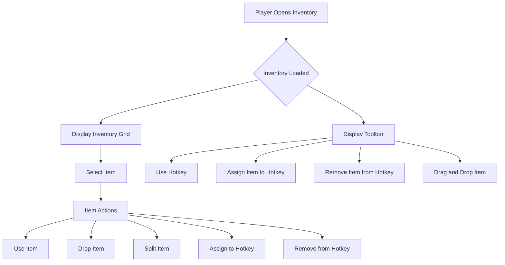

# Inventory System Documentation

The inventory system is a comprehensive solution that allows players to manage their items, equipment, and actions within the game. It features a visually appealing and intuitive user interface, seamless integration with the game's systems, and a robust set of functionalities to enhance the player experience.

## Features

1. **Inventory Management**: The system provides a grid-based inventory where players can store, organize, and manage their items. It supports various item types, such as weapons, consumables, and equipment.

2. **Toolbar and Hotkeys**: The system includes a persistent toolbar at the bottom of the screen, allowing players to quickly access and use their most important items using keyboard shortcuts.

3. **Item Actions**: Players can perform various actions on their items, including using, dropping, and splitting stacks. The system also supports item stacking and swapping.

4. **Weight Management**: The inventory system tracks the total weight of the player's carried items and applies movement penalties if the weight exceeds a defined limit.

5. **Inventory Visualization**: The system provides a visually appealing and intuitive user interface, with item icons, tooltips, and visual cues to enhance the player's understanding of their inventory.

6. **Persistence**: The inventory and equipment states are automatically saved and loaded, ensuring that players can continue their progress seamlessly.

7. **Extensibility**: The system is designed to be extensible, allowing for the addition of new item types, equipment slots, and functionality as the game evolves.

## API Overview

The inventory system exposes an API that allows other parts of the game to interact with the inventory. Here's a high-level overview of the available functions:

### `addItem(player, itemName, quantity)`

- **Description**: Adds the specified item to the player's inventory.
- **Parameters**:
  - `player`: The player object.
  - `itemName`: The name of the item to add.
  - `quantity`: The quantity of the item to add.
- **Returns**: `true` if the item was successfully added, `false` otherwise.

### `removeItem(player, itemName, quantity)`

- **Description**: Removes the specified item from the player's inventory.
- **Parameters**:
  - `player`: The player object.
  - `itemName`: The name of the item to remove.
  - `quantity`: The quantity of the item to remove.
- **Returns**: `true` if the item was successfully removed, `false` otherwise.

### `hasItem(player, itemName)`

- **Description**: Checks if the player has the specified item in their inventory.
- **Parameters**:
  - `player`: The player object.
  - `itemName`: The name of the item to check.
- **Returns**: `true` if the player has the item, `false` otherwise.

### `getItemCount(player, itemName)`

- **Description**: Retrieves the total count of the specified item in the player's inventory.
- **Parameters**:
  - `player`: The player object.
  - `itemName`: The name of the item to count.
- **Returns**: The total count of the item in the player's inventory.

### `canAddItem(player, item)`

- **Description**: Checks if the player can add the specified item to their inventory based on the weight limit.
- **Parameters**:
  - `player`: The player object.
  - `item`: The item object to check.
- **Returns**: `true` if the item can be added, `false` otherwise.

### `getTotalWeight(items)`

- **Description**: Calculates the total weight of the specified items.
- **Parameters**:
  - `items`: An array of item objects.
- **Returns**: The total weight of the items.

### `updateInventoryWebview(player)`

- **Description**: Updates the inventory display in the player's webview.
- **Parameters**:
  - `player`: The player object.

## Flowchart

This flowchart outlines the main functionalities and interactions within the inventory system.
